# **BLACK & WHITE BEAUTY**

### LIVE WEBSITE: **[Link to the Deployed Site](https://black-and-white-beauty.herokuapp.com/)**

____
____
____
____

***A NOTE ON THE 2nd contributor:***
Neil McEwwn (Code Institute) who had to change my files to adapt to a crossover from Gitpod to CodeAnywhere - I had originally done the change myself and he confirmed I had everything in place and did it correctly but it wasn't working. He redid the process requested a pull request and I accepted the change. In the end I reverted all these changes as CodeAnywhere was rife with issues and I had lost too much time already so went back to Gitpod. 

---

**TABLE OF CONTENTS**

- [Introduction](#introduction)
- [UX](#ux)
  - [Strategy](#strategy)
  - [Marketing Strategy](#marketing-strategy)
  - [Scope](#scope)
  - [Structure](#structure)
  - [Skeleton](#skeleton)
  - [Surface](#surface)
- [Agile](#agile)
- [Features](#features)
  - [Header](#header)
  - [Footer](#footer)
  - [Homepage](#homepage)
  - [Items](#Items)
  - [Item Details](#item-details)
  - [Commissions](#Commissions)
  - [Commission Details](#Commission-details)
  - [Cart](#cart)
  - [Checkout](#checkout)
  - [Order Confirmation / history](#order-confirmation--history)
  - [User Profiles](#user-profiles)
  - [Store Management](#Store-management)
  - [Reviews](#review-management)
  - [FAQ Management](#FAQ-management)
  - [Error Pages](#error-pages)
- [Marketing Strategy Implementation](#marketing-strategy-implementation)
  - [Branding](#branding)
  - [SEO](#seo)
  - [Keywords](#keywords)
  - [Newsletter](#newsletter)
  - [Social media](#social-media)
* [Future Development, Iteration and Implementation](#future-development-iteration-and-implementation)
* [Technologies Used](#technologies-used)
    * [Languages Used](#languages-used)
    * [Frameworks Used](#frameworks-used)
    * [Databases Used](#databases-used)
    * [Libraries and Packages Used](#libraries-and-packages-used)
    * [Programmes and Applications Used](#programmes-and-applications-used)
    * [Payment Processing Platform Used](#payment-processing-platform-used)
    * [Cloud Application Platforms Used](#cloud-platforms-used)
    * [Cloud Storage Services Used](#cloud-storage-services-used)
* [Testing](#testing)
* [Bugs, Issues and Solutions](#bugs-issues-and-solutions)
* [Deployment and Local Development](#deployment-and-local-development)
    * [Deployment](#deployment)
    * [Local Development](#local-development)
        * [How to Fork](#how-to-fork)
        * [How to Clone](#how-to-clone)
* [Credits](#credits)
* [Acknowledgements](#acknowledgements)

# Introduction

Black & White Beauty is a B2C e-commerce website for the final project of the Code Institute diploma in Software Engineering.

Black & White Beauty is a fictitious e-commerce full stack project built using Django, Python, JavaScript and Bootstrap 4. The site is deployed to Heroku, uses Amazon S3 for cloud storage and Stripe for payment processing. Black & White Beauty is a business to consumer online retailer of black and white illustrations.

The site provides role based permissions for users to interact with a central dataset. It includes user authentication, email validation and CRUD functionality.

The payment system uses Stripe. Please note that this website is for **educational purposes** only and the payment gateway is not set up to accept real payments. Do not enter any personal credit/debit card details when using the site.

When testing the site, please use the following from Stripe's testing documentation: 

- a Stripe test card number, such as `4242 4242 4242 4242`, or `4000 0582 6000 0005` for UK.
- a future expiry date, such as 04/24.
- any three-digit CVC.

---
# UX 
## STRATEGY
# UX

## Strategy

### The Problem

Buying affordable art thats perfect for a gallery wall.
### The Solution

Offering prints is a way to keep the price of art down. Small prints are perfect to fill the gaps between larger pieces and can bring a whole vwall together by having multiple within the same schema.
### Target Audience

Consumers that love art, wildlife and nature, who appreciate a small Irirsh business and handmade items.

*Go back to the [top](#table-of-contents)*

---

## Marketing Strategy

The main goal of the company is to sell small pieces or art or offer services in the form of commissions with a strong focus on charity donations giving 5% of all sales not profits to the Irish WIldlife Trust.

Having a strong brand and a solid, trustworthy and easy to use website creates a good foundation for the company to build its online presence, extending the reach of a small artist in a small town in Ireland.

With the website as an asset and a newsletter email list as a starting point, we can then share the brand on social media or online advertising, continue to evolve the SEO, and build out additional features (such as a blog, educational resources and IWT  campaigns and collaborations ) to help increase traffic to the site. We could run social media competitions and email campaigns, where customers take phots of flora or fauna they see in the wild for it to be added to be drawn and added in the store with the wining person recieving the orginal drawing which are not normally for sale

&nbsp;
## Scope

### User Expectations
1. As a user I expect the app to be responsive.
2. As a user I expect a successful transaction.
3. As a user I expect my data to be secure.

### User Stories

**EPIC ADMIN & Store Management**
- #1  As an admin, I can add/edit/delete products through an easy-to-use front end admin page so that I can manage the products available.
- #2  As an admin, I can add/delete images of previous past commission pieces so that I can show potential customers the scope of commissions
- #3  As a admin I can view customer orders so that I can full fill the orders or amend if needed
- #4  As a Admin I can manage the reviews on the site so that I can remove them if I no longer feel they are still necessary or needed #5  As an admin I can manage the commissions content so that I can make amendments if needed
- #6  As a Admin I can view queries sent via contact form so that I can act upon them accordingly
- #7  EPIC ADMIN & Store Management
-  As an admin, I can view and customer enquiries on the front-end without having to access the admin panel

**EPIC Viewing and Navigation** 
- #8  As a Site User, I can intuitively navigate around the site so that I can easily find content and info I am looking for
- #9  As a Site User, I can view a variety of items on a page so that I can select an item to view.
- #10  As a user I can search for items so that I can find specific items quickly
- #11  As a user I can sort items by category so that I can filter through the items on offer
- #12  As a user I can sort items by price so that I can filter through the items on offer
- #13  As a user I can browse through all available item so that I can see all my options for buying
- #14  As a user I can look at item details so that I can gain greater knowledge about the item. 
- #15  As a user I can easily see the price of the item so that I can easily decide if an item is in my budget
- #16  As a user I can easily see reviews of an item if any so that I can gain insight into what others have thought of their purchase once it was in their hands.

 **EPIC User Account and Profile** 
- #20 As a user I can create, read, edit my account so that I can have a more personalised experience and update my details accordingly  
- #21 As a user I can login in to my account so that I can view my order history
- #22 As a user I can logout of my acc so that I can safely use public computers 
- #23 As a site user, I can save my personal details in my user profile so that I do not have to fill them out for future orders.  
- #24 As a site user, I can view my order history so that I can remember what purchases I've made
- #26 As a site user, I can recover my password in case I forget it so that I can recover access to my acc

**EPIC Purchasing** |
- #28 As a shopper, I can add a variety of items in different quantities to my shopping cart so that I can purchase them all at once
- #29 As a shopper, I can view a sum total of my shopping cart as I am shopping so that I can keep within my budget
- #30 As a shopper, I can view the contents of my shopping cart at any time so I can easily make comparisons and adjustment
- #31 As a shopper, I can adjust the quantity of individual items in my cart so that I can easily make changes before I purchase
- #32 As a shopper, I can see a summary of my shopping cart when I checkout so that I can verify my choices before I commit to purchasing.
- #33 As a shopper, I can checkout securely so that I can I maintain the level of trust on submitting my card details
- #34 As a shopper, I can view my order confirmation after checkout so that I know my purchase was successful
- #35 As a shopper, I can receive an email confirmation of my order so that I have a record of my purchase

**EPIC User Interaction** 
- #37 As a site user, I can receive confirmation on my interactions in the site so that I can be sure my actions were successful or unsuccessful.
- #38 As a site user, I can submit an enquiry form so that I can have my question, complaint or commission query answered
- #39 As a site user, I can add a review in relation to a product I received so that I can give my feedback.  
- #41 As a site user, I can sign up for the website's newsletter so that I can keep up to date with the latest news and collections
- As a site user I can use the contact form so that I can contact the site owner

**EPIC: FAQ**  
- #61 As a user I can access frequently asked questions so I can potentially have a query answered without having to make contact | PASS |
- #62 As an admin I can add, edit and delete frequently asked questions so customers can have potential queries answered without having to make contact

My goal was to get the a basic version of the site fully functioning before adding additional features. A site where a user could create a profile, complete and order with all the confirmations, and that the admin could edit the items. After that I set about working on my custom models and finessing the styling and Additional User stories were created along the way.

&nbsp;
## Structure

I used Lucid app to create a diagram of the models

**Database models**

---

## Skeleton

The website uses a well-known and well-experienced web design pattern, to provide a comforting and predictable experience to users.  navigation in the middle and important links in the top right. Each page has a large title, except for the product detail page. The header and footer pages match in color, allowing users to quickly find their way around. The main page wireframes, designed on Balsamiq, were used as a guidline but tweaks in design were made when I could see everything visually on the screen.

[wireframes](docs/wireframes)

&nbsp;
## Surface

I wanted to create a simple design with colours that are natural yet fresh. 

### Colours

#0E1D18 - a deep forest green - dark enough to apear black on screen
#A4C3B2 - a soft sage green
#fff5ee - a delicate rose petal pink 
The red and blue of the edit and delete buttons were originally boostrap but were changed to add more visability and contrast as well as keeping in with the overall look. 

 
 
 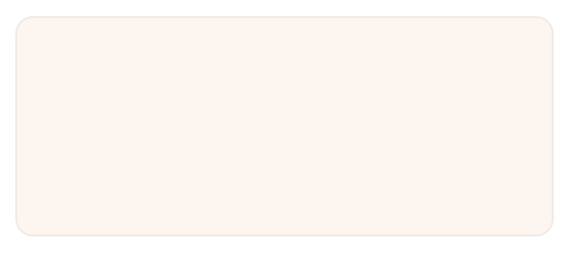
 
 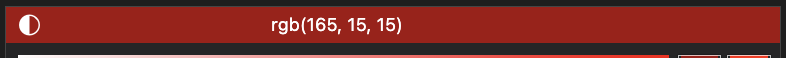

&nbsp;
### Fonts

The logo and main font throughout the site uses [Raleway](https://fonts.google.com/specimen/Raleway?preview.text=B&preview.text_type=custom). It's an easy to read font, adding a minimal and modern yet sometimes detailed touch. 

 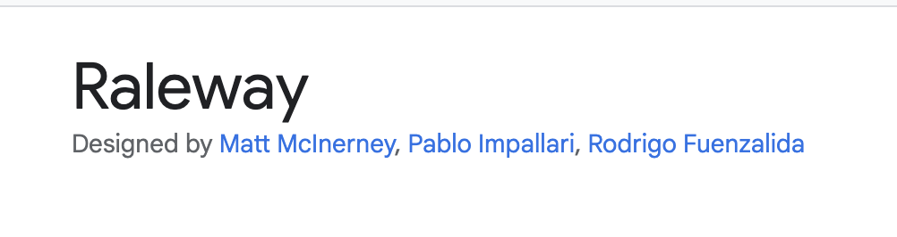

&nbsp;
### Images

The drawings used in throughout the app are my own. 

&nbsp; 

# Agile

Epics and User Stories were all divided up and added as issues in the issues tab of Github
User Stories had acceptance criteria/tasks in the form of check boxes. 

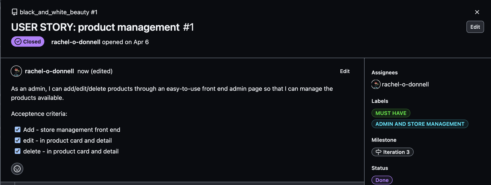

All issues were coverted to a Github Kanban project board found in the Github Projects tab or by clicking [here](https://github.com/users/rachel-o-donnell/projects/11)

Product Backlogs were created using the Milestones feature in Github. 1 main product board was created 1st and each iteration was drawn from this board in order of priority.
Timeboxing was used by creating Iterations in the Milestones tab of Github with each iteration being one week long.
Issues were added to each iteration at the start of each week using MosCow prioritisation (with new labels added to each issue) and using the 60% 20% rest method. These issues were also ordered from top priority on the top of the list down.

Issues that were not completed were added back into the main Product Backlog Milestone at the end of each iteration and the board was reprioritised.
# PROJECT BOARDS AND ITERATIONS

Each Epic and User Story was given a label(s) to visually connect to the theme or epic it belonged to.
Each Epic and User Story was color coded to have more harmonious connection to the Theme.
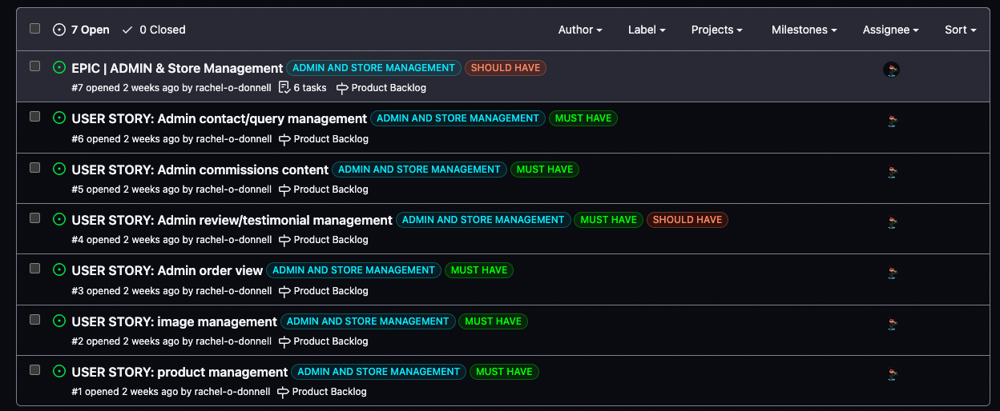
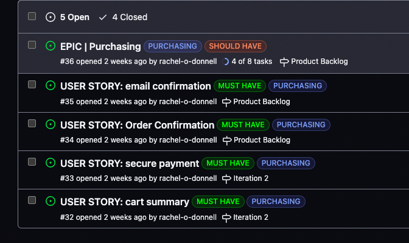
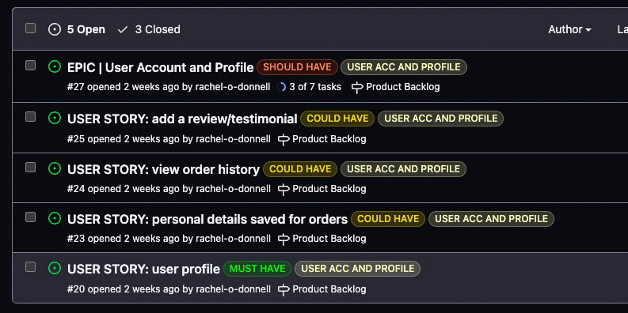
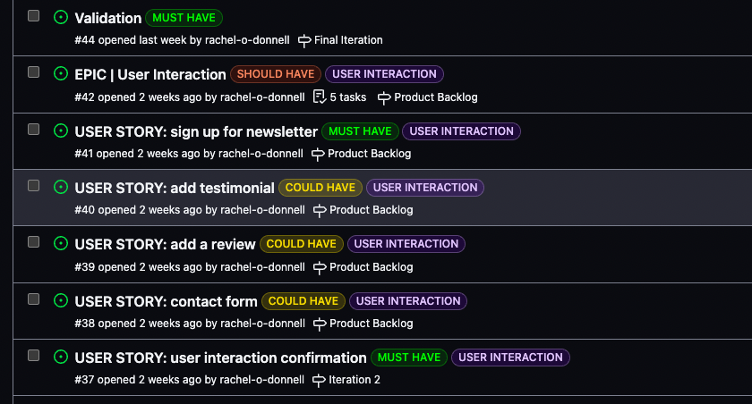
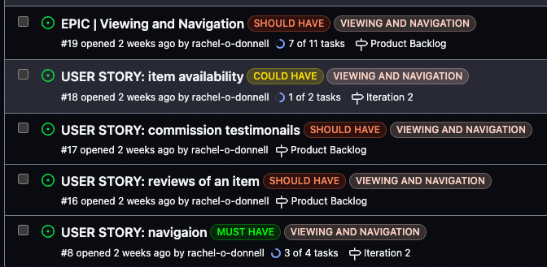

## Iteration 1
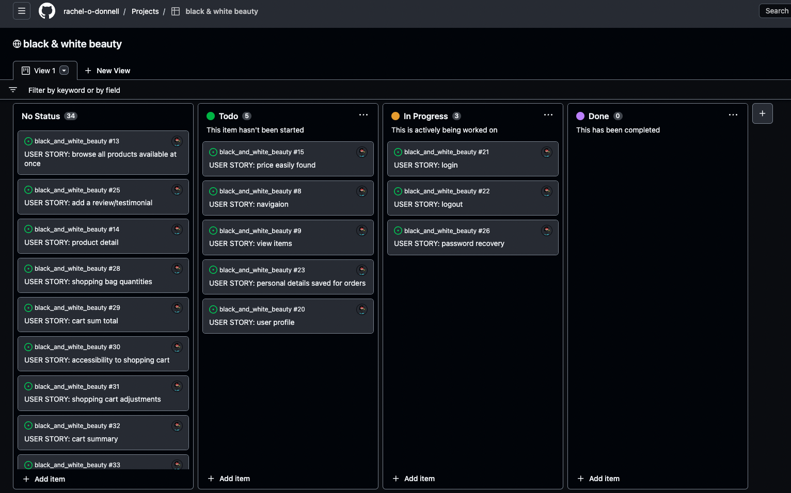
## Iteration 2
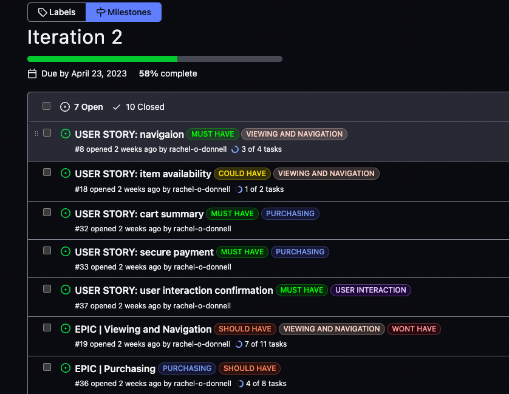
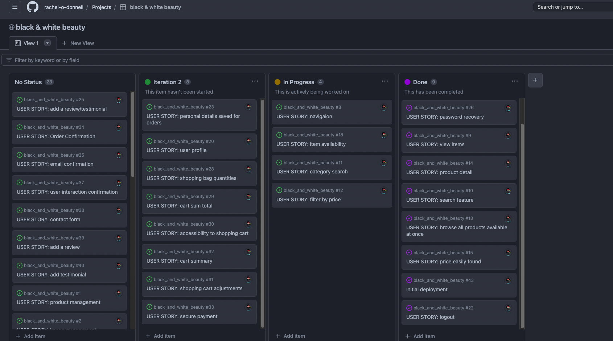
## Iteration 4
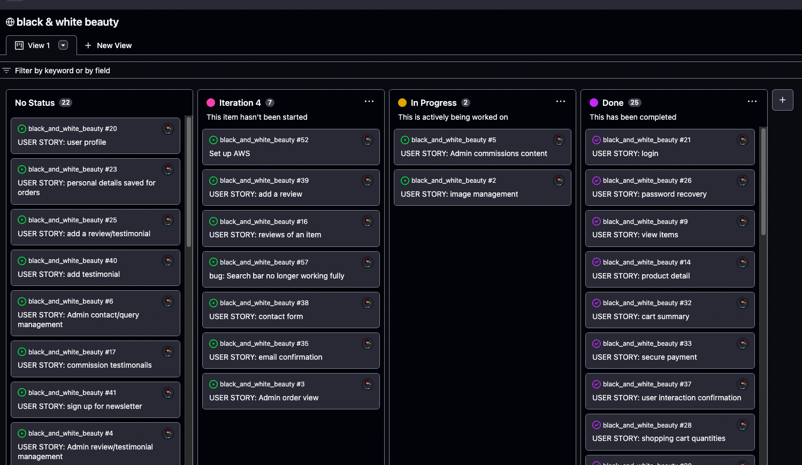
## Iteration 5
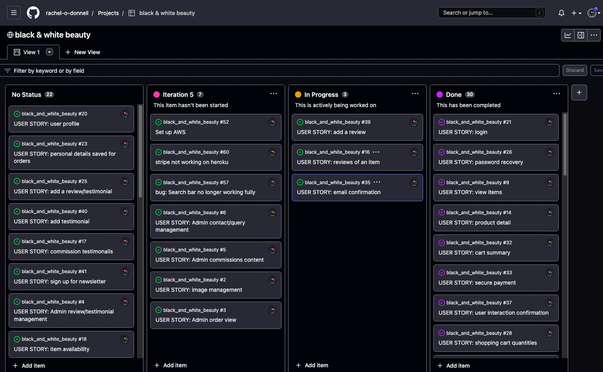
## Iteration 6
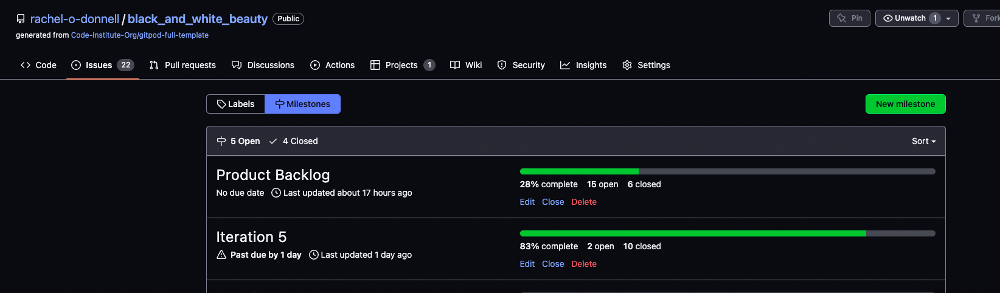
## Iteration 7
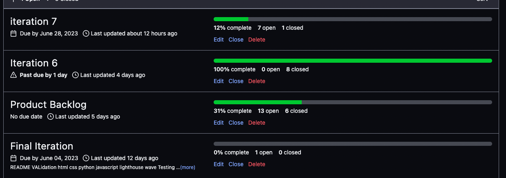
## Final Iteration 
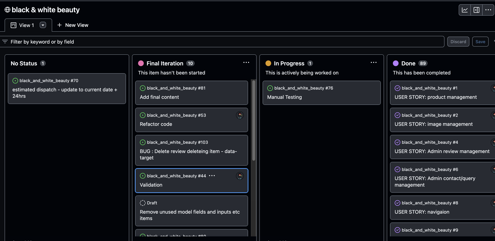
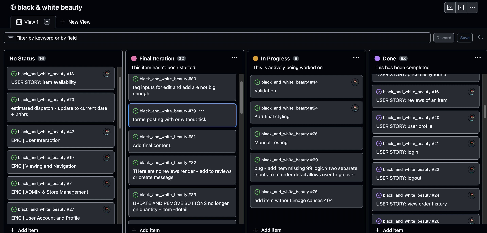

&nbsp; 

# FEATURES

## Header
Everything that was scheduled to be added to the app has been implemented. With the addition of the Producers app.

## Header

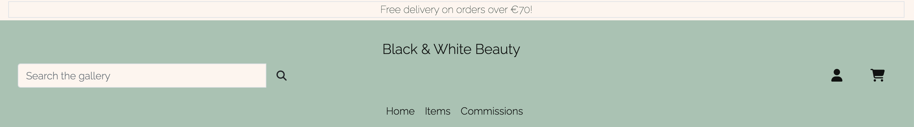
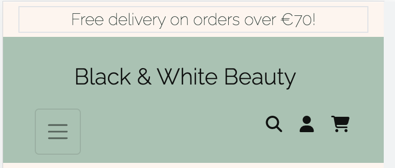

On opening the site, users will be welcomed by a clean and fresh familiar site layout.

- The header has a free delivery threshold banner, to let users know that they can get free shipping if they place an order over €70.
- the logo sits in the middle.
- On larger screens, there is a search form to to the left. this is reduced to the search icon and moved to the right with the other icons on smaller screens.
- The "Account" button displays a dropdown menu that provides links for "Register" and "Login", allowing users to either register for a new account, or login with an existing one. Once logged in, the links update to "My Profile" and "Logout". If logged in as a superuser, there is additional options "Store Management", "FAQs"s and "Enquiries" link available here.
- The cart button opens up a mini version of the cart page. If there are no items in the cart, it will show a button to "Continue shopping". If there are items, it will display a summary of these, along with a subtotal, delivery charge and grand total.
- The main navigation contains the "Home", "Items", and "Commissions", links, helping users to easily navigate to the main parts of the site. 
- On smaller screens, the main navigation is replaced with a "hamburger" icon on the left side. Clicking on the hamburger button reveals the offcanvas menu, containing the logo, search form and main navigation. Leaving just the  search, "Account" and cart buttons visible for easy access.

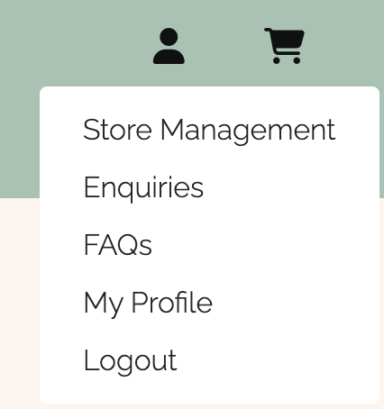
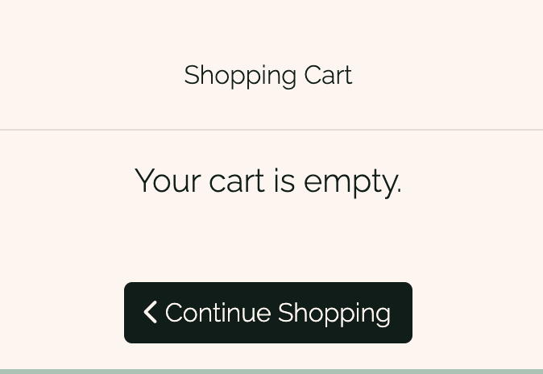
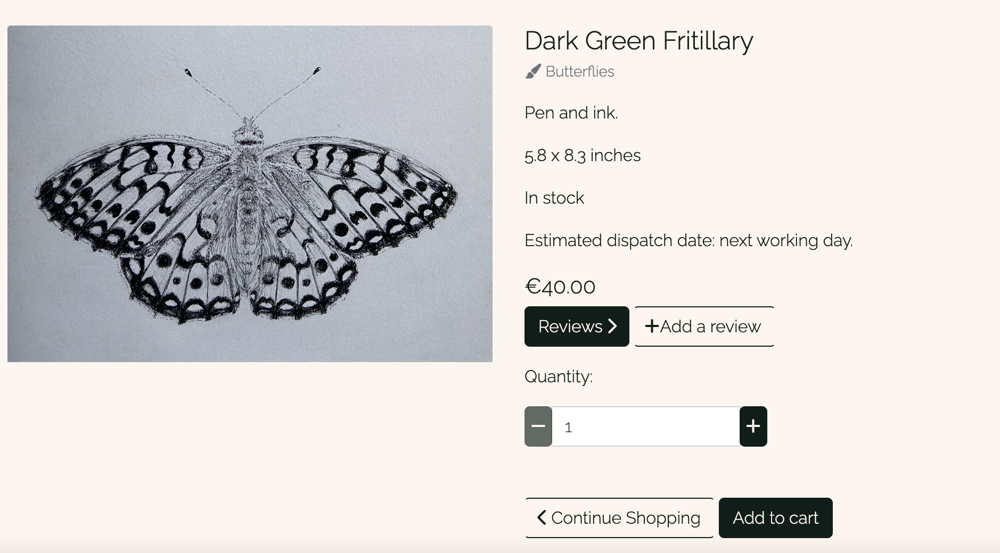
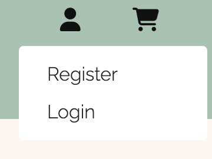
&nbsp; 

[ more Header images](docs/features/header/)

&nbsp; 

## Footer

The footer anchors the site by using the same colour as the header

- The 1st section provides social media icons that (would) connect to the company's various social media accounts. These are external links and open in a separate tab for convenience, and to allow the user to return to the site easily.
- There's a button to subscribe to the newsletter through Mailchimp. If the user has not already subsribed, they will see a success message. If they have already subscribed, they will see a message stating this.
- Links to the "contact us", "Faqs" and a "Privacy Policy". The latter helps SEO by allowing spiderbots to crawl the site easily, and providing more trust, for both users and search engines.
- The organisation logos and links of the Irish Wildlife Trust sit on the right. 
- At the very bottom is the copyright. 

&nbsp; 
## Homepage

- The homepage holds a large image of the companies hero image with a short and sweet overview of what the user can find on the site
-  Hosts a link inviting users to shop the galery taking them to view all the items in the sstore

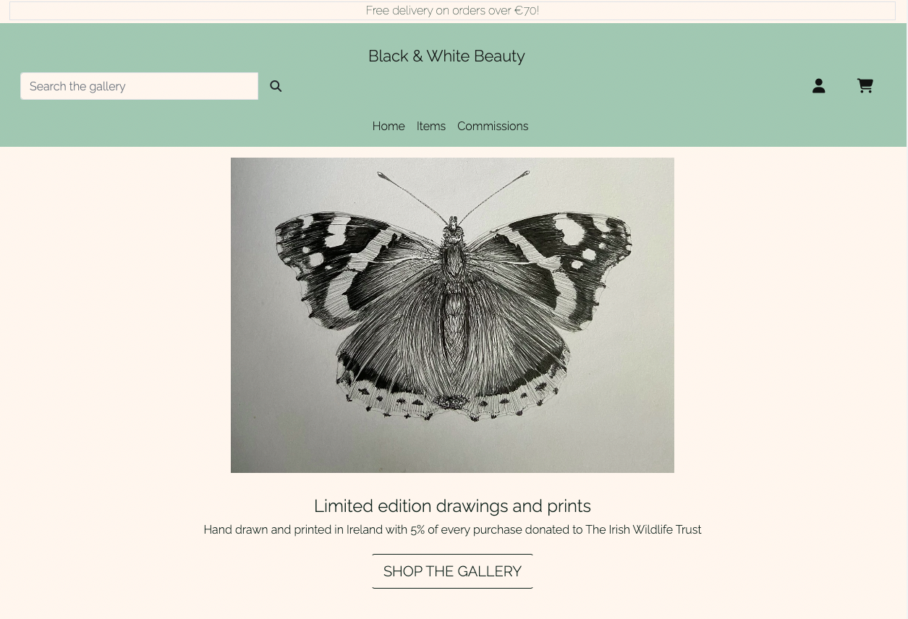

&nbsp; 

## Items

- a fully responsive view of all items 
- each items image is displayed on a card with key information - its name, price and whether its in stock or not and its category
- clicking on hte image opens up the item detail page

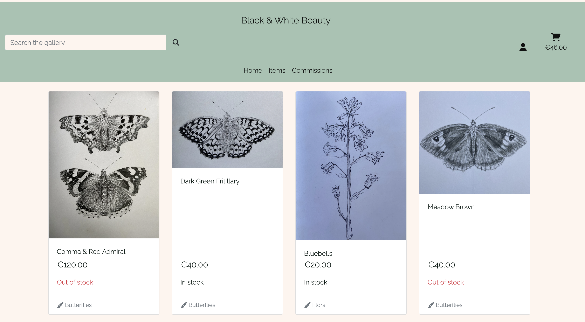

&nbsp; 

## Item Details
## Commissions
## Commission Details
## Cart
## Checkout
## Order Confirmation / history
## User Profiles
## Store Management
## Reviews
## FAQ Management
## Error Pages

# **Future Development, Iteration and Implementation**
| **FOR FUTURE IMPLEMENTATION** |   |
| --- | --- |

---
# **TECHNOLOGIES USED**
## **Languages Used**
* [HTML5](https://en.wikipedia.org/wiki/HTML5) was used for the content and structure of the site.
* [CSS3](https://en.wikipedia.org/wiki/CSS#CSS_3) was used for the styling of the site.
* [JavaScript](https://en.wikipedia.org/wiki/JavaScript) was used for the interactivity of the site.
* [Python](https://www.python.org/) was used for the back end programming of the site.
## Frameworks Used
* [DJANGO - v3.2 ](https://docs.djangoproject.com/en/4.1/releases/3.2/) Django is a free and open-source, Python-based web  framework that follows the model–template–views architectural pattern.
* [Bootstrap4 - v4.6](https://getbootstrap.com/docs/4.6/getting-started/introduction/) was used as the frontend framework.
## Databases Used
* [DB.SQLITE3](https://docs.djangoproject.com/en/4.1/ref/databases/#sqlite-notes) was the database used for the project (development).
* [ElephantSQL](https://www.elephantsql.com/) ElephantSQL's Postgres as a Service was used to host the the database for the project (production).
## **Libraries and Packages Used**
* [django-allauth](https://django-allauth.readthedocs.io/en/latest/) is an integrated set of Django applications dealing with account authentication, registration, management, and third-party (social) account authentication.
* [JQuery - v3.5.1](https://jquery.com/) is a fast, small, and feature-rich JavaScript library.
* [Font Awesome Kit](https://fontawesome.com/v5/docs/web/setup/use-kit) is used for its icon toolkit.
* [django-countries, v7.2.1](https://pypi.org/project/django-countries/7.2.1/) was the Django application used to provide country choices for use with forms, and a country field for models.
* [django-crispy-forms, v1.14.0](https://pypi.org/project/django-crispy-forms/) was used to build programmatic reusable layouts out of form components.
* [gunicorn](https://gunicorn.org/) - a Python WSGI HTTP Server that allows us to run any Python application concurrently by running multiple processes within a single dyno
* [pillow](https://pypi.org/project/Pillow/) - a required Python imaging library used to enable handling of images.
* [psycopg2](https://pypi.org/project/psycopg2/) - a postgresql database adapter for python and used to connect with our postgres database
* [boto3==1.26.27](https://pypi.org/project/boto3/), [botocore==1.29.27] is an Amazon Web Services (AWS) software development kit (SDK) used to connect to the S3 bucket
* [pip](https://pip.pypa.io/en/stable/) is the package installer for Python, allowing us to install the packages we need for this site.
* [django storages](https://django-storages.readthedocs.io/en/latest/) - collection of custom storage backends for Django

## **Programmes and Applications Used**
* [Lucid Chart](https://www.lucidchart.com/pages/) was used to draw and build the Entity Relationship Diagram. It was also used to draw the User Flow Diagram.
* [favicon.io](https://favicon.io/) used to create the site's favicon
* [Git](https://git-scm.com/) used for version control and saving work in the repository, using the GitPod extension in Google Chrome to commit to GitHub.
* [GitHub](https://github.com/) is the project's git repository
* [GitHub Projects](https://docs.github.com/en/issues/planning-and-tracking-with-projects/learning-about-projects/about-projects) used to track and integrate issues for Agile Development
* [Chrome DevTools](https://www.google.com/intl/en_uk/chrome/) - used for debugging, validation (Lighthouse) and taking fullscreen screenshots of the site
* [ezgif](https://ezgif.com/)

## **Payment Processing Platform Used**
* [Stripe](https://stripe.com/gb) was used to test and implement the payment processing for the site.

Stripe how to test cards interactively:
| **CARD NUMBER** | **MM &amp; YY**  | **CVC** | **SIMULATED PAYMENT RESULT** |
| --- | --- | --- | --- |
| 4242 4242 4242 4242 | use any valid future month and year | use any three digit CVC | successful payment |
| 4000 0000 0000 0002 | use any valid future month and year | use any three digit CVC | generic decline |

## **Cloud Application Platforms Used**
* [Heroku](https://devcenter.heroku.com/) was used for hosting and deployment of the live site. Throughout, we have ensured the version being deployed to Heroku matches the development version by checking features and screen layouts on both versions.

## **Cloud Storage Services Used**
* [AWS S3](https://aws.amazon.com/) was used to store the images and static files.
---

# **TESTING**
Please refer to [TESTING.md](./TESTING.md) file for:
* Manual Testing and Results
* Validation of all languages
* Lighthouse scores

 

---
# **BUGS, ISSUES AND SOLUTIONS**
Please also refer to [TESTING.md](./TESTING.md) file for:
* Solutions to bugs found during testing and development phase
* Known bugs
 

---
# **DEPLOYMENT**
Please refer to [DEPLOYMENT.md](./DEPLOYMENT.md) file for:
* Creating the database to be used in production
    * Instructions to common question: *"What if you didn't use fixtures in your project?"*
* Deploying to Heroku
* Setting up AmazonS3 for hosting our static and media files
---

# **CREDITS**
## **Code** 

https://github.com/rachel-o-donnell/booutique-ado : The project very much got its start from Code Institutes walkthrough project

PROJECTS I looked through for inspiration and problem solving
https://github.com/rachel-o-donnell/rising-women
https://github.com/AliOKeeffe/PP5-Fresh-Nest
https://github.com/davidcalikes/sensical.ie
https://github.com/lucywoodman/the-chocolate-factory
https://github.com/JoyZadan/shop-kbeauty
https://github.com/Iris-Smok/JoyfulBookstore-PP5
https://github.com/rachel-o-donnell/the-witchs-cauldron

README structure and deployment steps are from
https://github.com/JoyZadan/shop-kbeauty

editing commit messages
https://linuxhint.com/remove-committed-file-after-push-in-git/#:~:text=Display%20the%20existing%20content%20of,file%20from%20the%20local%20repository.
https://stackabuse.com/git-revert-to-a-previous-commit/

* [ 10 minute mail ](https://10minutemail.com/)
* [ Irish Wildlife Trust ](https://iwt.ie/)
* [ Favicon ](https://realfavicongenerator.net/)

## **Content**

The policies were generated from:
* [Privacy Policy Generator ](https://www.privacypolicygenerator.info/download.php?lang=en&token=2YTFAh7Aa8GDO5knKT5gJ2WAr7mS9EG2)

## **Media**
* All images used in the site are my own drawings

## **Other Resources**
These other resources were used for research and/or for finding solutions when I got stuck.
1. [Stack Overflow](https://stackoverflow.com/)

---

# **ACKNOWLEDGEMENTS**
A massive thank you to my cohort team members Eleanor, Ivette and Roz for always being on hand to troubleshoot bugs and issues, and my mentor Richard Wells fr all the advice and support!

*Go back to the [top](#table-of-contents)*