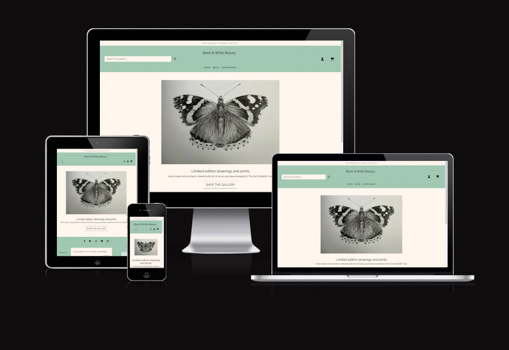

# **Black & White Beauty Testing Results**

 

**[Link to the Deployed Site](https://black-and-white-beauty.herokuapp.com/)**

---
## TABLE OF CONTENTS

* [Validation](#validation)
* [Responsivness](#responsiveness)
    * [HTML Validation](#html)
    * [CSS Validation](#css)
    * [JavaScript Validation](#javascript)
    * [Python Validation](#python)
    * [Lighthouse Report](#lighthouse)
        * [Desktop](#desktop)
        * [Mobile](#mobile)
* [Testing](#manual-testing)
    * [Testing User Stories](#testing-user-stories)
    * [Full Testing](#full-testing)
* [Bugs, Errors & Solutions](#bugs-found-during-testing-and-development-phase)
    * [Solved Bugs](#solved-bugs)
    * [Known Bugs](#known-bugs)# MANUAL TESTING

&nbsp; 

# Responsiveness 
Dev tools were used to ensure responsiveness while in development but the site can be tested here -> [AM I Responsive ](https://ui.dev/amiresponsive?url=%20https://8000-rachelodonn-blackandwhi-39a79qr72yb.ws-eu98.gitpod.io) 
| Testing | Results |
|--------|---------|
| Navbar - goes to burger | PASS |
| footer | PASS |
| Home Page - fully responsive | PASS |
| Spell Detail Page | PASS |
| Add Spell | PASS |
| Edit Spell | PASS |
| Delete Spell | PASS |
| Edit Comment  | PASS |
| Delete Comment | PASS |
| Categories page | PASS |
| Register | PASS |
| Loggout | PASS |
| Login | PASS |
| My Profile page | PASS |
| ORDER CONFIRMATION PAGE | PASS |
| Enquiries.html | PASS | 
| edit item | PASS |
| Home page | PASS |
| Login page | PASS |
| Loggout page | PASS |
| Register page | PASS |
| Password reset | PASS |
| CART.HTML WITH ITEMS | PASS |
| CART EMPTY HTML | PASS |
| Items page | PASS |
| Items detail page | PASS |
| Store Management page | PASS |
| Edit Items page | PASS |
| Delete Items page | PASS |
| Commissions page | PASS |
| Commissions detail page | PAS |
| Contact.html | PASS |
| Enquiries.html | PASS |
| Faq page | PASS |
| add Faq page | PASS |
| edit Faq page | PASS |
| delete FAq page | PASS |
| see reviews page (1 review )| PASS |
| see reviews page ( more than 1 review )| PASS |
| no reviews page | PASS |
| add reviews page with image | PASS |
| add reviews page without image | PASS |
| delete reviews page | PASS |
| My Profile page | PASS |
| Past order detail | PASS |
| Add item to cart with checkout pop up with items in the toast | PASS | 
| Cart | PASS |
| Checkout | PASS |
| Order confirmation page | PASS |
| 500 | PASS | 
| 403 | PASS | 
| 404 | PASS | 

# Code Validation
&nbsp;

# HTML
Wc3 HTML: All pages pass without error

| Testing | Results |
|--------|---------|
| Home page | PASS |
| Login page | PASS |
| Loggout page | PASS |
| Register page | PASS |
| Password reset |  PASS |
| CART.HTML WITH ITEMS | PASS |
| CART EMPTY HTML | PASS |
| Items page | PASS | 
| Items detail page | PASS |
| Store Management page | PASS |
| Edit Items page | PASS |
| Delete Items page | PASS |
| Commissions page | PASS |
| Commissions detail page | PASS |
| Contact.html | PASS |
| Enquiries.html | PASS |
| Faq page | PASS |
| add Faq page | PASS |
| edit Faq page | PASS |
| delete FAq page | PASS |
| see reviews page (1 review )| PASS |
| see reviews page ( more than 1 review )| PASS |
| no reviews page | PASS |
| add reviews page with image | PASS |
| add reviews page without image | PASS |
| delete reviews page | PASS |
| My Profile page | PASS |
| Past order detail | PASS |
| Add item to cart with checkout pop up with items in the toast | PASS |
| Cart | PASS |
| Checkout | PASS |
| Order confirmation page | PASS |
| 500 | PASS | 
| 403 | PASS | 
| 404 | PASS | 

&nbsp;

# CSS 
Jigsaw Wc3 validation - passes without error

| Testing | Results |
|--------|---------|
| Base.css | PASS |
| Checkout.css | PASS | 
| Profiles.css | PASS |
 
&nbsp;

# JAvascript - JShint 

The only two errors came from JAvacript taken from Stripe and Mailchimp. I decided not to alter in case it broke the functionalities of either feature
[Jshint](./docs/jshint)

| Testing | Results | image |
|--------|---------|---------|
| CART.HTML | PASS | [cart.html-js](./docs/jshint/cart.html-js.png) |
| Contact_form.html | PASS | [contact_formjs](./docs/jshint/contact_formjs.png) |
| Enquiries.html | PASS | [enquiries.htmljs](./docs/jshint/enquiries.htmljs.png) |
| Add_item.html | PASS | [add_item](./docs/jshint/add_itemjs.png)
| Edit_Item.html | PASS | [edit_itemjs](./docs/jshint/edit_itemjs.png)|
| Items.html (1) | PASS | [items.htmljs](./docs/jshint/items.htmljs.png) |
| Items- quantity-input.html | PASS | [qty-input-scripjs-items](./docs/jshint/qty-input-scripjs-items.png) |
| Commissions.html | PASS | [commissions.html-js](./docs/jshint/commissions.html-js.png) 
| countryfield/js profiles | PASS | [countryfield.js-profiles](./docs/jshint/countryfield.js-profiles.png) |
| add_review.html | PASS | [add_review](./docs/jshint/add-review.html-js.png)
| Base.html toasts | PASS | [base.html-toast-js](./docs/jshint/base.html-toast-js.png) |
| allauth email.html | PASS | [allauth-email](./docs/jshint/allauth-email.html-js.png) |
| Checkout/js/stripe_elements.js | Error coming from Stripe |[Stripe-js](./docs/jshint/Stripe-js.png) [stripe-elements-js](./docs/jshint/stripe-elements-js.png) |
| Base.html MAilchimp | Errors - see image |[mailchimp-js-errors](./docs/jshint/mailchimp-js-errors.png) |

&nbsp;

# PYTHON
Pycodestyle used as linter in terminal

Pep8CI - all files pass without error and can be found here
[python validation images](./docs/python-validation/)

&nbsp;

# Lighthouse 
Wc3 HTML - All pages pass without error
[Lighthouse](/docs/lighthouse/)|
| Testing | Results | Mobile | Desktop|
|--------|---------|--------|---------|
| Home page | [mobile](/docs/lighthouse/home-mob-lh.png)| [Lighthouse-desktop](/docs/lighthouse/home-mobile-lh.png) |
| Login page |[Lighthouse-mobile](/docs/lighthouse/sign-in-mob-lh.png) | [Lighthouse-desktop](/docs/lighthouse/sign-in-dt-lh.png) |
| Loggout page |[Lighthouse-mobile](/docs/lighthouse/sign-out-mob-lh.png) | [Lighthouse-desktop](/docs/lighthouse/sign-out-dt-lh.png) |
| Register page |[Lighthouse-mobile](/docs/lighthouse/sign-up-mob-lh.png) | [Lighthouse-desktop](/docs/lighthouse/sign-up-dt-lh.png) |
| CART.HTML WITH ITEMS |[Lighthouse-mobile](/docs/lighthouse/cart-mob-lh.png) |[Lighthouse-desktop](/docs/lighthouse/cart-dt-lh.png) |
| CART EMPTY HTML |[Lighthouse-mobile](/docs/lighthouse/cart-empty-mob-lh.png) | [Lighthouse-desktop](/docs/lighthouse/cart-empty-dt-lh.png) |
| All Items page |[Lighthouse-mobile](/docs/lighthouse/all-items-mob-lh.png) | [Lighthouse-desktop](/docs/lighthouse/ad-item-dt-lh.png) |
| Items-butterflies page |[Lighthouse-mobile](/docs/lighthouse/butterflies-mob-lh.png) | [Lighthouse-desktop](/docs/lighthouse/butterflies-dt-lh.png) |
| Items-flora page |[Lighthouse-mobile](/docs/lighthouse/flora-mob-lh.png) | [Lighthouse-desktop](/docs/lighthouse/flora-dt-lh.png) |
| Items-fish page |[Lighthouse-mobile](/docs/lighthouse/fish-mob-lh.png) | [Lighthouse-desktop](/docs/lighthouse/fish-dt-lh.png) |
| Items detail page |[Lighthouse-mobile](/docs/lighthouse/item-detail-mob-lh.png) | [Lighthouse-desktop](/docs/lighthouse/item-detail-dt-lh.png) |
| Store Management page |[Lighthouse-mobile](/docs/lighthouse/ad-item-mob-lh.png) | [Lighthouse-desktop](/docs/lighthouse/ad-item-dt-lh.png) |
| Edit Items page |[Lighthouse-mobile](/docs/lighthouse/edi) |
| Commissions page | [Lighthouse-mobile](/docs/lighthouse/commiss-mob-lh.png) | [Lighthouse-desktop](/docs/lighthouse/comiss-dt-lh.png) |
| Commissions detail page |[Lighthouse-mobile](/docs/lighthouse/com-detail-mob-lh.png) | [Lighthouse-desktop](/docs/lighthouse/com-detail-dt-lh.png) |
| Contact.html |[Lighthouse-mobile](/docs/lighthouse/contact-mob-lh.png) | [Lighthouse-desktop](/docs/lighthouse/contact-dt-lh.png) |
| Enquiries.html | [Lighthouse-mobile](/docs/lighthouse/enquires-mob-lh.png) | [Lighthouse-desktop](/docs/lighthouse/enquiries-dt-lh.png) |
| Faq page | [Lighthouse-mobile](/docs/lighthouse/) | [Lighthouse-desktop](/docs/lighthouse/fa) |
| add Faq page | [Lighthouse-mobile](/docs/lighthouse/add-faq-mob-dt-lh.png) | [Lighthouse-desktop](/docs/lighthouse/add-faq-mob-dt-lh.png) |
| edit Faq page | [Lighthouse-mobile](/docs/lighthouse/edit-faq-mob-lh.png) | [Lighthouse-desktop](/docs/lighthouse/edit-faq-dt-lh.png) |
| see reviews page | [Lighthouse-mobile](/docs/lighthouse/reviews-mob-lh.png) | [Lighthouse-desktop](/docs/lighthouse/reviews-dt-lh.png) |
| no reviews page | [Lighthouse-mobile](/docs/lighthouse/no-review-mob-lh.png) | [Lighthouse-desktop](/docs/lighthouse/no-review-dt-lh.png) |
| add reviews page | [Lighthouse-mobile](/docs/lighthouse/add-review-mob-lh.png) | [Lighthouse-desktop](/docs/lighthouse/add-review-dt-lh.png) |
| My Profile page |[Lighthouse-mobile](/docs/lighthouse/profile-mob-lh.png) | [Lighthouse-desktop](/docs/lighthouse/profile-dt-lh.png) |
| Past order detail /order confirmation| [Lighthouse-mobile](/docs/lighthouse/order-conf-mob-lh.png) | [Lighthouse-desktop](/docs/lighthouse/order-conf-dt-lh.png) |
| Checkout | [Lighthouse-mobile](/docs/lighthouse)

&nbsp;

## Manual Testing
### Testing User Stories
### **User Stories**
| **Number** | **User Story** | **Result** |
| :-- | :-- | :-- |
| **ADMIN & Store Management** |  |  |  |  |  |
| #1 | As an admin, I can add/edit/delete products through an easy-to-use front end admin page so that I can manage the products available. | PASS | 
| #2 | As an admin, I can add/delete images of previous past commission pieces so that I can show potential customers the scope of commissions | PASS | 
| #3 | As a admin I can view customer orders so that I can full fill the orders or amend if needed | PASS |
| #4 | As a Admin I can manage the reviews on the site so that I can remove them if I no longer feel they are still necessary or needed | PASS | 
| #5 | As an admin I can manage the commissions content so that I can make amendments if needed | PASS |
| #6 | As a Admin I can view queries sent via contact form so that I can act upon them accordingly | PASS  |
| #7 | EPIC ADMIN & Store Management ||
| Maybe? | As an admin, I can view and customer enquiries on the front-end without having to access the admin panel. | PASS |
| **EPIC Viewing and Navigation** |
| #8 | As a Site User, I can intuitively navigate around the site so that I can easily find content and info I am looking for | | 
| #9 | As a Site User, I can view a variety of items on a page so that I can select an item to view. | | 
| #10 | As a user I can search for items so that I can find specific items quickly | |
| #11 | As a user I can sort items by category so that I can filter through the items on offer | | 
| #12 | As a user I can sort items by price so that I can filter through the items on offer  | |
| #13 | As a user I can browse through all available item so that I can see all my options for buying | | 
| #14 | As a user I can look at item details so that I can gain greater knowledge about the item.   || 
| #15 | As a user I can easily see the price of the item so that I can easily decide if an item is in my budget. | |
| #16 | As a user I can easily see reviews of an item if any so that I can gain insight into what others have thought of their purchase once it was in their hands.  | |
| #17 | As a user I can see testimonials of the commissions process to gain insight into how it was for others to work and collaborate with the site owner. | | 
| #18 | As a user I can the amount of a single item is available so that I can see how many are in stock.    ||
| #19 | EPIC Viewing and Navigation  | |
| **EPIC User Account and Profile** |
| #20 | As a user I can create, read, edit, or delete my account so that I can have a more personalised experience and update my details accordingly   | |
| #21 | As a user I can login in to my account so that I can view my order history    || 
| #22 | As a user I can logout of my acc so that I can safely use public computers | | 
| #23 | As a site user, I can save my personal details in my user profile so that I do not have to fill them out for future orders.  | |
| #24 | As a site user, I can view my order history so that I can remember what purchases I've made | |
| #25 | As a site user, I can view my order history so that I can add a review/testimonial  | |
| #26 | As a site user, I can recover my password in case I forget it so that I can recover access to my account.  | |
| #27 | EPIC User Account and Profile | |
| **EPIC Purchasing** |
| #28 | As a shopper, I can add a variety of items in different quantities to my shopping bag so that I can purchase them all at once. | |
| #29 | As a shopper, I can view a sum total of my shopping cart as I am shopping so that I can keep within my budget. | |
| #30 | As a shopper, I can view the contents of my shopping cart at any time so I can easily make comparisons and adjustments ||
| #31 | As a shopper, I can adjust the quantity of individual items in my cart so that I can easily make changes before I purchase.  ||
| #32 | As a shopper, I can see a summary of my shopping cart when I checkout so that I can verify my choices before I commit to purchasing. || 
| #33 | As a shopper, I can checkout securely so that I can I maintain the level of trust on submitting my card details | |
| #34 | As a shopper, I can view my order confirmation after checkout so that I know my purchase was successful.  ||
| #35 | As a shopper, I can receive an email confirmation of my order so that I have a record of my purchase. | |
| #36 | EPIC Purchasing | |
| MAYBE |As a shopper, I can checkout as a guest so I don't have to sign up for an account. | | 
| **EPIC User Interaction** | 
| #37 | As a site user, I can receive confirmation on my interactions in the site so that I can be sure my actions were successful or unsuccessful. | | 
| #38 | As a site user, I can submit an enquiry form so that I can have my question, complaint or commission query answered. | | 
| #39 | As a site user, I can add / edit / delete a review in relation to a product I received so that I can give my feedback.  | |
| #40 | As a site user, I can add / edit / delete a testimonial in relation to a piece I commissioned so that I can give my feedback on the process   | |
| #41 | As a site user, I can sign up for the website's newsletter so that I can keep up to date with the latest news and collections | | 
|#42 | EPIC User Interaction | |

| **EPIC: FAQ**  | decided to do this as commissions was not too different to products

| #61 As a user I can access frequently asked questions so I can potentially have a query answered without having to make contact
- #62 As an admin I can add, edit and delete frequently asked questions so customers can have potential queries answered without having to make contact. 
- #63 EPIC: FAQs

 
#### User stories not yet implemented 
 
The following user stories were scoped out of the project due to time constraints and labelled as "Won't Have" on the project board on Github. It is intended that these user stories will be implemented at a later date. 
 
As a user I can add products to my wishlist so that I can think about them and come back to them at a later date 

FAQ

- As a shopper, I can add products to my saved items so that I can go back and view them at a later date. 
- As a shopper, I can view my saved products so I can find them easily in the one location. 

blog
- As a site user I can view paginated posts so that I can select which posts to view 
- As a site user I can view all posts so that I can decide what I may be interested in reading 
- As a site user I can comment to the blog posts so that I can express my opinion to the post 
- As a site user I can use the contact form so that I can contact the site owners
# Manual Testing

### Methodology

Manual tests were applied as I was building features to ensure all features added were as fully finished as needed at their respective stages. Any bugs found were either dealt with immediately or noted in READme for future fixing. Validators of affected/changed files /pages were rechecked after each bug fix after initial validation had begun

&nbsp;

### Hover Category Column expectations and steps : button changes color or adds an underline when hovered over and/or curser changes | hovered over Post button 

&nbsp;

#### NAVBAR 
| Testing | Expected Outcome | Steps | Hover | Results |
|--------|---------|---------|---------|---------|
| Logo | Logo link brings you to the home page | Clicked logo link when on different pages | PASS | PASS|
| Searchbar | Searching a title or description of an item will bring up the results of the search | Searched for various titles, keywords | PASS | PASS
| Home | Home button takes you to the home page | Clicked Home in Nabvar on various pages | PASS |  PASS |
| Items | Items dropdown features a list of categories | Clicked Categories button | PASS | PASS |
| Categories | Clicking the categories links will bring you to a page with all items relating to that category | Clicked all categories, each time the page rendered Items that had been tagged with that category | PASS | PASS |
| Commissions | Clicking the Commissions links will bring you to a page with all commissions content| CLicked link and the page rendered the commissions | PASS | PASS |
| account icon | Gives a list of options to the user and added options to admin | Clicked Account icon as user | PASS | PASS |
|||Clicked Account icon as admin | PASS |  PASS |
| Log In | Sign In takes you to a sign in page |  Clicked Sign In | PASS | PASS |
| Register | Register takes you to a register page |  Clicked Register in Nabvar | PASS | PASS |
| Register Confirm email | Registering send a real email with a link to confirm your email | Registered as a new user using 10minutemail.com | PASS | PASS | 
| Logout | Logout takes you to a logout page |  Clicked Logged Out in Nabvar | PASS | PASS |
| My Profile | Brings user to their profile page| Clicked my profile | PASS | PASS |
|ADMIN EXRAS |
| Store Management | clicking this brings you to add an item page | Clicked link| PASS | PASS |
| Enquiries | clicking this brings admin to view all the enquires people have made from the contact form | Clicked link| PASS | PASS |
| FAQ | clicking this brings you to add a FAQ page | Clicked link| PASS | PASS |
| Cart icon | clicking this brings you to the cart page | Clicked link | PASS | PASS |
| Cart amount| Adding items to your cart displays value on the navbar | added items to cart | PASS | PASS |
| TOAST MESSAGES |
| Sign In | Sign In message appears in banner |  Signed In | PASS | PASS |
| Register | Register message appears in banner |  Registered as new User | PASS | PASS |
| Logout | Logout message appears in banner |  Logged out | PASS | PASS |

&nbsp;

#### HOME PAGE 
| Testing | Expected Outcome | Steps | Hover | Results | 
|--------|---------|---------|---------| --------- |
| Shop the gallery | clicking this button takes you to all the items in the store | Clicked button | PASS | PASS |

&nbsp;

#### ITEMS PAGE 
| Testing | Expected Outcome | Steps | Hover | Results |
|--------|---------|---------|---------|---------|
| header displays the correct label | header displays a corresponding title depending on search  - | choose different categories | - | PASS | 
| cards display correct info | cards display correct info | added item | PASS | PASS | 
| Clicking on image field | brings you to item detail page | clicked image | PASS | PASS |
| category field | clicking link renders that category page | clicked link | PASS | PASS |
| sort by | clicking renders drop down | clicked | PASS | PASS |
| sort by choices | clicking choices orders the view from low to high price or vice versa | clicked | PASS | PASS |
| Back to top | Clicking brings you to the top of the page | Clicked | PASS | PASS |
| ADMIN EXTRAS |
| ACCESS| Can only be accessed by Admin | - | PASS | 
| Edit | clicking brings you to Edit Items page | clicked |  PASS | PASS |
| Delete | clicking renders a confirmation/delete pop up | clicked  | PASS | PASS |

&nbsp;

#### ITEMS DETAIL PAGE
| Testing | Expected Outcome | Steps | Hover | Results |
|--------|---------|---------|---------|---------|
| extra info displayed | - |  - |  - | PASS|
| reviews button | clicking renders reviews page | clicked | PASS | PASS |
| Item in stock | Item in stock, add to bag and qty button displays, dispatch est is next day |  updated item to in stock | - | PASS |
| Item out of stock | Item out of stock, add to bag and qty button disappear - contact button displayed |  updated item to out of stock | - | PASS |
| add reviews button | Pressing add review renders the review form | pressed the add review button | PASS | PASS |
| Quantity button | add and minus buttons work | pressed plus and minus buttons | PASS | PASS |
| Quantity button disabled | minus button disables when item is at 1 , plus disable when items are at 98 | pressed plus and minus buttons | PASS | PASS |
|Quantity input negative numbers | cannot add negative numbers - user is prompted to correct their input | Entered -1 into input box | PASS | PASS |
|Quantity input over 99 items | cannot add more than 99 items to cart - user is prompted to correct their input | Entered 100 into input box | PASS | PASS |
| Quantity input over 99 items | cannot add more than 99 items to cart by adding in separate transactions - user is prompted by toast to correct their input | Entered 100 into input box | - | FAIL | - Send the message but still adds the items
|Update button | MISSING  | DOES IT NEED TO BE HERE OR JUST IN THE CART???
|Delete button | MISSING |  DOES IT NEED TO BE HERE OR JUST IN THE CART???
| Continue shopping | clicking brings to all items page | clicked button | PASS | PASS |
| Add to cart | Adds item with quantity to cart | added various quantities of items to cart | PASS | PASS |
| if item oos |
| Contact Us | Clicking link opens the contact form page | clicked link |  PASS | PASS |
| ADMIN EXTRAS |
| ACCESS| Can only be accessed by Admin | typed items/edit to end of url as normal user | - | PASS |
| Edit Items button | Clicking renders Edit Items page |  clicked button | PASS | PASS |
| Delete Items | Clicking renders Delete Items Pop up | clicked button | PASS | PASS |
| ITEMS TOAST MESSAGES |
| Edit item | Your Item was edited message appears | Edited an item | PASS | PASS |
| Delete item| Your Item was deleted message appears | Deleted an item | PASS | PASS |

&nbsp;

#### CART POP UP 
| Testing | Expected Outcome | Steps | Hover | Results |
|--------|---------|---------|---------|---------|
| cart summary | displays summary of cart items | added items to cart | - |PASS |
| Free delivery prompt | If free delivery threshold isn't met message is displayed with how much more to spend to get free delivery | Added items below threshold value| - | PASS|
| Free delivery prompt not displaying | When threshold is met free delivery message is displayed | Added items over threshold | - | PASS | 
| checkout button | Go to secure checkout page | clicked | - | PASS | 

&nbsp;

#### COMISSIONS PAGE 
| Testing | Expected Outcome | Steps | Hover | Results |
|--------|---------|---------|---------|---------|
| header displays the correct label | - | - | - | PASS | 
| cards display correct info | - | - | - | PASS | 
| image field | Clicking on image field brings you to commission detail page | clicked | - | PASS | 
| Back to top | Clicking brings you to the top of the page | Clicked | PASS | PASS |

&nbsp;

#### COMMISSIONS DETAIL PAGE
| Testing | Expected Outcome | Steps | Hover | Results |
|--------|---------|---------|---------|---------|
| Displays extra info | - | - | - | PASS | 
| Continue shopping | Clicking brings you back to all items page | Clicked | PASS | PASS 
| Contact Us | Clicking link opens the contact form page | clicked link |  PASS | PASS |

&nbsp;

#### PROFILE
| Testing | Expected Outcome | Steps | Hover | Results |
|--------|---------|---------|---------|---------|
| Default Delivery info (Blank) (see more in  CHECKOUT FORM : PERSONAL DETAILS -> PROFILE PAGE ) | 
| Update Info button | Editing the form and Clicking this saves the new information to the page | Created new user, entered info, clicked button | PASS | PASS |
| Order History | Order History Displayed | Bought somethings as a user |  PASS | PASS |
|Order Confirmation | Order Confirmation can be accessed by clicking the order number link | clicked | PASS | PASS |
| ITEMS TOAST MESSAGES |
| Update Info | Update info message appears | Updated info | - | PASS |

&nbsp;

#### ORDER CONFIRMATION PAGE 
| Testing | Expected Outcome | Steps | Results | Hover |
|--------|---------|---------|---------|---------|
| Full order summary is displayed | - | - | - | PASS |
| Back to profile button | - | - | PASS | PASS | 

&nbsp;

#### CART
| Testing | Expected Outcome | Steps | Hover | Results |
|--------|---------|---------|---------|---------|
| Cart empty |
| Continue shopping | clicking brings to all items page | clicked button | PASS | PASS |
| Cart with items |
| Items displayed | - | - | - | PASS | 
| Quantity button | add and minus buttons work | pressed plus and minus buttons | PASS | PASS |
| Quantity button disabled | minus button disables when item is at 1 , plus disable when items are at 98 | pressed plus and minus buttons | PASS | PASS |
|Quantity input negative numbers | cannot add negative numbers - user is prompted by toast to correct their input  by toast message | Entered -1 into input box | PASS | PASS |
|Quantity input over 99 items | cannot add more than 99 items to cart - user is prompted by toast to correct their input | Entered 100 into input box | - | PASS |
| User cannot have over 99 items in cart  | cannot add more than 99 items to cart - user is prompted to correct their input | Entered 50 items in one action then tried to add 50 of the same item in another action | PASS | PASS |
|Update button | Changing number in input and pressing this updates quantity and toast message appears  | Adjusted amount and pressed update | PASS | PASS |
| Subtotal calculated | - | PASS | 
| Continue shopping | clicking brings to all items page | clicked button | PASS | PASS |
| Delivery charges |
| Delivery threshold met | Delivery charge is 0, free delivery message in blue | Added amount over 70euro | - | PASS | 
| Delivery threshold unmet | Delivery charge is added, Free delivery prompt message in red | Added amount under 70euro | - | PASS | 
| Continue shopping | clicking brings to all items page | clicked button | PASS | PASS |
| Back to top | Clicking brings you to the top of the page | Clicked | PASS | PASS |
| Secure checkout |  Clicking brings you to checkout page | Clicked | PASS | PASS |

&nbsp;

#### TOAST MESSAGES CART AND ADDING TO CART
| Testing | Expected Outcome | Steps | Results |
|--------|---------|---------|---------|
| Add Item to cart | Item added to cart appears with a summary of how many and a cart summary | Added multiple Items to cart | - | PASS |
| Update quantity Item - item page | Your Comment was edited message appears | Updated cart amount from item detail page  | - | PASS |
| Update quantity Item in cart - cart page | Your cart was edited message appears | Updated cart amount from cart page | - | PASS |
| Quantity input negative numbers | cannot add negative numbers | Added negative number in  | PASS | PASS |
| Delete an Item in cart - item page | Your Comment was deleted message appears | Deleted an item | PASS | PASS |
| Delete an Item in cart - cart page| Your Item was deleted message appears | Deleted an item | PASS | PASS |

&nbsp;

#### CHECKOUT FORM : PERSONAL DETAILS
| Testing | Expected Outcome | Steps | Hover | Results |
|--------|---------|---------|---------|---------|
| NEW USER | 
| Users email and info are automatically input in they have filled out their profile delivery info blank otherwise | Created new user filled out details in profile and form is filled |  IS THIS SUPPOSED TO HAPPEN whEN BOX TICK IS FIXED
| Relevant field and labels are displayed | - | - |  PASS |
| Form Validation EMPTY | Form validation will prompt for user action if empty form is submitted |   Try to submit empty form |- | PASS |
| Form Validation Only Required Fields | Form validation will prompt for user action to fill content if only title is filled |  Try to submit only title | - | PASS |
| Form Validation ALL DETAILS | complete purchase and submit bring you to order Confirmation page with details of order | Fill all details of form and submit  | PASS | PASS |
| save delivery info box | delivery info displayed in Profile Page if remember box is ticked | Ticked box | PASS | FAIL - DAVES WITH AND WITHOUT TICK |
| Confirmation EMAIL | complete purchase and submit Order Confirmation email with details of order | Fill all details of form and submit | - |  PASS |
| Order goes to order history | Order goes to order history | Completed order went to profile | - |  PASS |
| Stripe payment | Stripe payment working | Completed order went to Stripe Developer Webhooks | - |  PASS |
| ITEMS TOAST MESSAGES |
| Success message | Confirmation message appears with order number | Completed a purchase | - | PASS |

&nbsp;

#### FORMS 

#### REVIEWS 
#### ADD A REVIEW FORM
| Testing | Expected Outcome | Steps | Hover | Results |
|--------|---------|---------|---------|---------|
| Relevant field and labels are displayed | - | - | - | PASS |
| Form Validation EMPTY | Form validation will prompt for user action if empty form is submitted |   Try to submit empty form | - | PASS |
| Form Validation Only Required Fields | clicking submits review, review renders in correct area |  submit only required fields  | - | PASS |
| Form Validation With Image | clicking submits review, review renders in correct area with image | Submit form with image | -  | PASS |
| Form Validation Without Image | clicking submits review, review renders in correct area with stock image of the item | Submit form with image | -  | PASS |
| Form Validation ALL DETAILS | Fill all details of form | User returned to homepage and post is displayed with all relavant info on home page and all extra details  - | PASS |
| Dropdown menus | dropdown features a list of items or commissions | Clicked button | PASS | PASS |
| Select Image has prompt| - | - | - | PASS |
| Select Image Adds filename | - | - | - |  PASS |
| Featured Button has prompt  | - | - | - |  PASS |
| Featured tick box | ticking this publishes review to site  otherwise renders in django admin | PASS | PASS | 
| Submit button | clicking bring submits review, review renders in correct area | clicked | PASS | PASS |
| Cancel Button | clicking bring back to home page | clicked | PASS | PASS |

&nbsp;

### REVIEW FORM VIEW: REVIEWS
| Testing | Expected Outcome | Steps | Results | Hover |
|--------|---------|---------|---------|---------|
| Review form submissions are rendered for correct item | - | - | - |  PASS | 
| header displays the correct label | Reviews header should match the item | clicked on reviews | PASS | PASS | 
| appear by Oldest to newest | - | - | - |  PASS |
| All fields are displayed | - | added a review | - | PASS | 
| Featured tick box | ticking this publishes review to site  otherwise renders in django admin | ticked | PASS | PASS | 
| Continue shopping | clicking brings to all items page | clicked button | PASS | PASS |
| ADMIN EXTRAS |
| Delete | Delete modal pop upp appears on click | clicked  | PASS | PASS |
| Delete Review | deletes review on click | clicked  PASS | PASS |
| Back button | brings user back to item detail page | clicked | PASS | PASS | 
| REVIEWS TOAST MESSAGES |
| ADD review| review added message appears | Added review | PASS | PASS |
| Delete review | Your review was deleted message appears | Deleted a review | PASS | PASS  | 

&nbsp;

#### CONTACT FORM
| Testing | Expected Outcome | Steps | Hover | Results |
|--------|---------|---------|---------|--------|
| Relevant field and labels are displayed | - | - | - | PASS |
| Form Validation EMPTY | Form validation will prompt for user action if empty form is submitted |  Try to submit empty form | - | PASS |
| Form Validation Only Required Fields | Form submits and rendered in enquiries  |  Try to submit only title | - | PASS |
| Form Validation With Image | Post Will be uploaded and user returned to homepage, default category will be general| Try to submit only title and content | - | PASS |
| Form Validation ALL DETAILS | Fill all details of form | User returned to homepage and post is displayed with all relavant info on ADMIN Enquiries page | - | PASS |
| Dropdown menu | displays a list to choose from when clicked  | clicked  | PASS | PASS | 
| Select Image | Select Image has prompt| - | - | PASS| PASS |
| Select Image | Select Image Adds filename | added files | - | PASS | 
| Submit button | clicking renders form to admin enquiries page | Clicked | PASS | PASS |
| Cancel Button | clicking brings you to home page | Clicked | PASS | PASS |
| ITEMS TOAST MESSAGES | message displays when submitted | submitted form | - | PASS | 

&nbsp;

### CONTACT FORM VIEW: ENQUIRIES
| Testing | Expected Outcome | Steps | Hover | Results |
|--------|---------|---------|---------|---------|
| Contact form submissions display in Admin Enquiries Page | - | - | - | PASS | 
| ACCESS | Can only be accessed by Admin | - | - | PASS |
| All fields are displayed | - | - | - | PASS | 
| display and ordering | Are numbered appear by date time (oldest 1st) | Added an enquiry | - | PASS |
| Optional fields | Optional fields display None or N/A if not completed | Added enquiry without these fields | - | PASS |
| Image | Image is rendered if added | added  image to enquiry | - | PASS | 

&nbsp;

#### ADD FAQ FORM 
| Testing | Expected Outcome | Steps | Hover | Results |
|--------|---------|---------|---------|--------|
| CRUD FEATURES FAQS | Admin can create, read update and delete a FAQ | - | - | PASS |
| ACCESS | Can only be accessed by Admin | - | - | PASS |
| Display | Relevant field and labels are displayed | - | - | PASS |
| Form Validation EMPTY | Form validation will prompt for user action if empty form is submitted |   Try to submit empty form | - | PASS |
| Form Validation Question | Form validation will prompt for user action to fill content if only Question is filled |  Try to submit only Question  ||
| Form Validation Answer | renders prompt | Try to submit only answer and content | PASS |
| Form Validation ALL DETAILS | Fill all details of form | appears in faq section | PASS |
| Submit button | submites faq and appears in faq | - | - | PASS |
| Cancel Button | cancels faq admin brough back to home page | - | - | PASS |
| FAQS |
| FAQS TOAST MESSAGES |
| Add Faq | Your Comment was deleted message appears | Added a comment | - | PASS |

&nbsp;

### FAQ FORM VIEW: FAQS
| Testing | Expected Outcome | Steps | Hover | Results |
|--------|---------|---------|---------|---------|
| FAQ form submissions display on FAQS Page |  - | - | - | PASS |
| All fields are displayed |  - | - | - | PASS |
| Ordered By Date | oldest 1st | Added FAQ | - | PASS |
| Contact Us | Clicking link opens the contact form page | clicked link |  PASS | PASS |
| Continue shopping | clicking brings to all items page | clicked button | PASS | PASS |
| ADMIN EXTRAS |
| ACCESS| Can only be accessed by Admin | - | - | PASS |
| Edit FAQ page |  - | - | - | PASS |
| Edit | clicking brings to Edit FAQ page | clicked | - | - | PASS |
| update FAQ | clicking brings to Delete FAQ page | Updated FAQ |  PASS | PASS |
|Delete FAQ page |
| Delete | Delete modal pop up appears | clicked | PASS | PASS |
| Delete modal | Faq is deleted | clicked | PASS | PASS |
| FAQS TOAST MESSAGES ||
| Edit Faq | Your faq was edited message appears | Edited a faq | PASS | PASS |
| Delete Faq | message appears | deleted a faq | PASS | PASS |
&nbsp;

#### ADD ITEM FORM 
| Testing | Expected Outcome | Steps | Hover | Results |
|--------|---------|---------|---------|---------
| ACCESS | Can only be accessed by Admin | - | - | PASS |
| Relevant field and labels are displayed | - | - | - | PASS |
| Category Dropdown | clicking displays a list of options | clicked | PASS | PASS |
| Form Validation EMPTY | Form validation will prompt for user action if empty form is submitted |   Try to submit empty form | - |PASS |
| Form Validation Only Required Fields | Dsiplays item in store and in the correct category fields |  Submitted from filled correctly  | - | PASS |
| Form Validation Without Image | cannnot submit form without image | - | -  | PASS  |
| Form Validation ALL DETAILS | Fill all details of form | User returned to homepage and post is displayed with all relevant info on all items page and all extra details on the items detail page, post appears in relevant category search | - | PASS |
| Select Image has prompt| - | - | - | PASS |
| Select Image Adds filename |  - | - | PASS| PASS |
| ADD item button | Adds item to the store | clicked | PASS| PASS |
| Cancel Button | brings user to all Items page | PASS| PASS |
| ITEMS TOAST MESSAGES |
| ADD Item | Item added message appears | Added an item |  PASS | PASS |

&nbsp;

### ADD ITEM VIEW: ITEMS/ CATEGORIES
| Testing | Expected Outcome | Steps | Hover | Results |
|--------|---------|---------|---------|---------|
| Contact form submissions display in All Items and Relevant Categories |
| All fields are displayed | - | - | - | PASS |

&nbsp;

#### EDIT ITEM FORM 
| Testing | Expected Outcome | Steps | Hover | Results |
|--------|---------|---------|---------|---------
| ACCESS | Can only be accessed by Admin | - | - | PASS |
| Image renders | Image of item renders | - | - | PASS |
| With image | Filename appears in red | added a new filename | - | PASS |

#### ERROR PAGES 
| Testing | Expected Outcome | Steps | Results |
|--------|---------|---------|---------|
| 404 |  404 Error page appears when page request does not exist | entered /help at the end of the http | PASS |
| Continue shopping | clicking brings to all items page | clicked button | PASS | PASS |
| 500 | 500 Error page appears when there is a server error | Unable to test server error | - | - |
| Continue shopping | clicking brings to all items page | clicked button | PASS | - |
| 403 | 403 Error page appears when user tries to access a page they are not allowed | Added faqs/edit_faq/1 to end of hhtp address when signed in as as regular user  | - | PASS |
| Continue shopping | clicking brings to all items page | clicked button | PASS | PASS |

&nbsp;

#### FOOTER
| Testing | Expected Outcome | Steps | Hover | Results |
|--------|---------|---------|---------|---------|
| Fontawesome icons | Clicking Fontawesome icons opens the respective page in a new tab, LinkedIN and Github are linked to my own pages | Clicked each icon | PASS | PASS | PASS |
| Contact Us | Clicking link opens the contact form page | clicked link |  PASS | PASS |
| FAQ | Clicking link opens the FAQ page | clicked link |  PASS | PASS |
| privacy policy | Clicking link opens the FAQ page | clicked link | PASS | PASS |
| Mailchimp | Subscribing should add you to mailchimp email | added email and clicked subscribe , checked if the mailchimp user number increased | PASS | PASS |
| Irish Wildlife Trust Logo | Clicking Logo link brings you to the IWT.ie page | Clicked logo | PASS | PASS |
| Footer Logo | Footer Logo link brings you to the home page | Clicked footer logo | PASS | PASS |

&nbsp;

Return to [README.md](https://github.com/rachel-o-donnell/blackandwhitebeauty/README.md) 